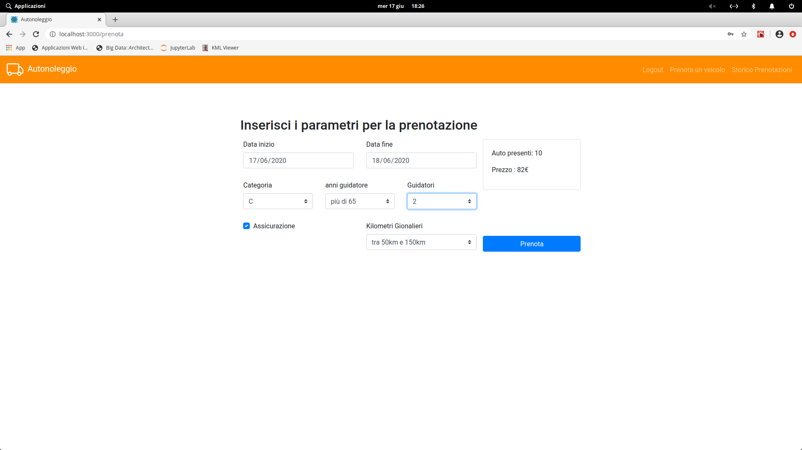

# Exam #12345: "Exam Title"
## Student: s276124 BERGIA STEFANO 

## React client application routes

- Route `/`: mostra tabella dei veicoli con i filtri su categoria e marca
- Route `/login`: permette di autenticarsi sul server inserend nome utente e password
- Route `/login/prenota`: come sopra ma una volta fatto il login si viene reindirizzati automaticamente alla route '/prenota'
- Route `/login/storico`: come sopra ma una volta fatto il login si viene reindirizzati automaticamente alla route '/storico'
- Route `/prenota`: permette di effettuare una richiesta di noleggio e di effettuare il pagamento
- Route `/storico`: permette di visualizzare l'elenco delle prenotazioni passate,presenti e future (queste ultime annullabili)

## REST API server

- POST `/api/carlist`
  - elenco dei modelli di auto con relativa quantità (q)
  - request parameters: nessuno
  - request body content: nessuno
  - response body content:  [{marca:'Fiat',modello:'500',categoria:'A',q:3},{marca:'Ford',modello:'Focus',categoria:'C',q:2}...]

- POST `/api/login`
  - request parameters: nessuno
  - request body content: username e password
  - response body content: username loggato + token jwt di accesso

- POST `/api/logout`
  - request parameters: nessuno
  - request body content: nessuno
  - response body content: nessuno, viene cancellato il token jwt lato client

- GET `/api/book` AUTENTICATA
  -restituisce il numero di auto disponibii e il relativo prezzo in base ai parametri del configuratore
  - request parameters: nessuno
  - request body: {
        user:'stefano',
        insurrance:true,
        startDate:'2020-06-17',
        endDate:'2020-06-20',
        category:'A',
        ageRange:1, (valori possibili 1-2-3)
        drivers:2,
        km:2 (valori possibili 1-2-3)
    }
  - response body content : {count:3,price:100}

- POST `/api/confirm` AUTENTICATA
  - inserisce nella tabella noleggi la prenotazione, restituisce un oggetto contenente il riepilogo
  - request parameters: nessuno
  - request body: {
        user:'stefano',
        insurrance:true,
        startDate:'2020-06-17',
        endDate:'2020-06-20',
        category:'A',
        ageRange:1, (valori possibili 1-2-3)
        drivers:2,
        km:2 (valori possibili 1-2-3)
    }
  - response body content : {
        req_id:23
        car_id:5,
        marca:'Fiat',
        modello:'500'
        categoria:'A',
        price:100
    }

- PUT `/api/confirm` AUTENTICATA
  - aggiorna la tabella dei noleggi per confermare una prenotazione a seguito del pagamento
  - request parameters:nessuno
  - request body content :{
            id:23,
            cardnumber:1234567890123456,
            ccv:123,
            completename:"Stefano Bergia"
        }
  - response body content: {msg:"OK"}

- DELETE `/api/confirm/:id` AUTENTICATA
  - elimina una prenotazione 
  - request parameters:id del parametro da eliminare
  - request body content :nessuno
  - response body content: {msg:"OK"}

- GET `/api/renthistory` AUTENTICATA
  - recupera l,'intera lista dei noleggi di un utente
  - request parameters:nessuno
  - request body content :nessuno
  - response body content:[{
        id:20,
        car_id:10,
        marca:'Fiat,
        modello:'500',
        categoria:'A',
        data_inizio:"2020-06-17",
        data_fine:"2020-06-20",
        n_guidatori:1,
        eta_guidatore:1,
        assicurazione:true,
        km_stimati:2
      }...]

- GET `/api/loggeduser` AUTENTICATA
  - ritorna lo username relativo ad un token jwt
  - request parameters:nessuno
  - request body content :nessuno
  - response body content:{usernme:'stefano'}

## Server database

- Table `car` - contains id marca modello categoria
- Table `user` - contains username password
- Table `noleggio` - contains id car_id username data_inizio data_fine n_guidatori eta_guidatore assicurazione km_stimati confirmed timestamp

## Main React Components

- `App` (in `App.js`): componente principale, gestisce le Route e la comunicazione tra gli altri componenti
- `CarSelector` (in `CarSelector.js`): 
gestisce la visualizzazione dell'elenco delle auto ed i relativi filtri composta da due elementi `CarTable` (in `CarTable.js`) contenete la tabella vera e propria e
`CarFilter` (in `CarFilter.js`)  che gestisce l'applicazione dei filtri
- `LoginForm` (in `LoginForm.js`): form per gestire l'autenticazione 
- `BookCarForm` (in `BookCarForm.js`): gestisce la prenotazione di un nuovo noleggio e il pagamento
 - `RentHistory` (in `RentHistory.js`): gestisce la visualizzazione dello storico dei noleggi

(only _main_ components, minor ones may be skipped)

## Screenshot

## Test users

* luigi, v3rd1
* margherita, 4r4nc10
* stefano, pwd (frequent customer)
* pesca, r054
* mario, r0551 (frequent customer)
